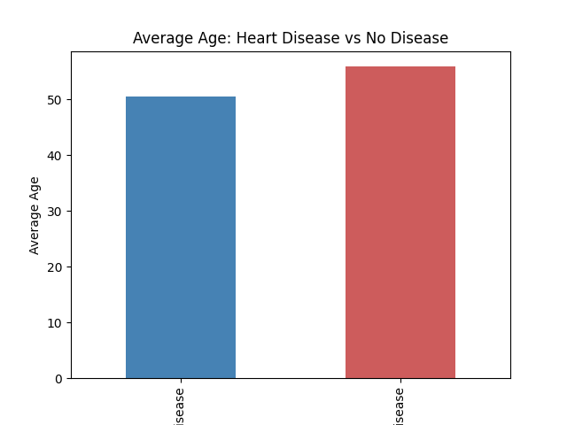
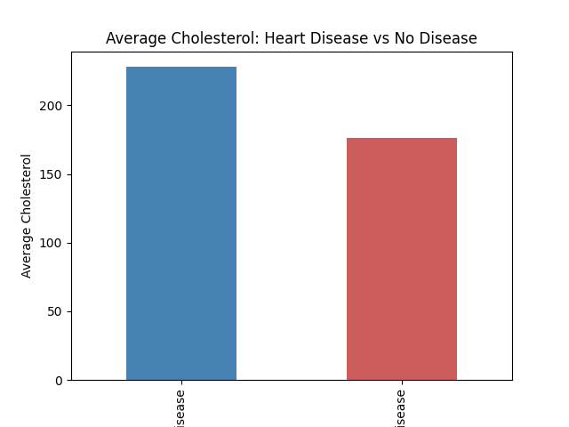

# Heart Disease Risk Factor Analysis

A data analysis project examining risk factors associated with heart disease using a real clinical dataset of 920 patients.

## Overview

This project explores the relationship between patient characteristics (age, cholesterol) and heart disease diagnosis, using Python for data cleaning, statistical analysis, and visualization.

## Dataset

- **Source:** UCI Heart Disease Dataset
- **Size:** 920 patient records, 16 features
- **Target variable:** Presence of heart disease (converted to binary: disease / no disease)

## Key Findings

### 1. Age and Heart Disease
Patients diagnosed with heart disease were, on average, **~5.4 years older** than patients without heart disease (55.9 vs. 50.5 years) — consistent with known cardiovascular risk patterns.

### 2. Cholesterol — A Data Quality Investigation
Initial analysis showed a counterintuitive result: patients *without* heart disease had a higher average cholesterol (227.9) than patients *with* heart disease (176.5) — the opposite of what clinical literature would predict.

Digging deeper, I found that **172 of 920 patients (19%) had a cholesterol value of exactly 0** — a medically impossible value, almost certainly representing missing data recorded as zero rather than left blank. Of those 172 zero-values, **152 (88%) belonged to the heart disease group**, meaning the "disease" group's average was being artificially dragged down by missing data, not a real physiological pattern.

**Takeaway:** A surprising result isn't automatically a meaningful one — it's worth investigating data quality before drawing conclusions.

## Tools Used
- Python (pandas, matplotlib)
- Descriptive statistics and group comparisons
- Data quality / missing-value investigation

## Files
- `heart-disease-data-analysis.py` — full analysis script
- `age_chart.png` — age comparison visualization
- `chol_chart.png` — cholesterol comparison visualization

## Author
Dhriti Bapna — [LinkedIn](https://www.linkedin.com/in/dhriti-bapna10/)

